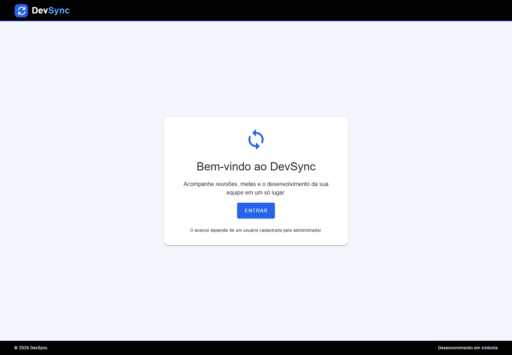
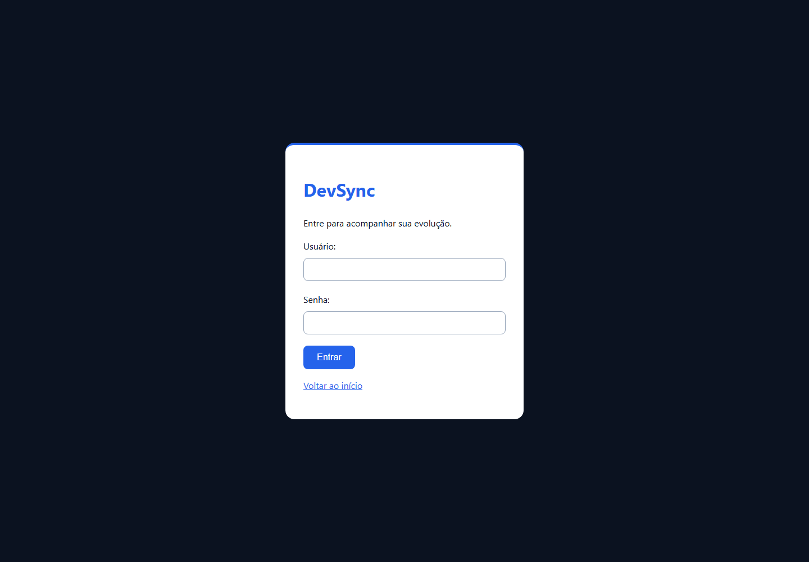
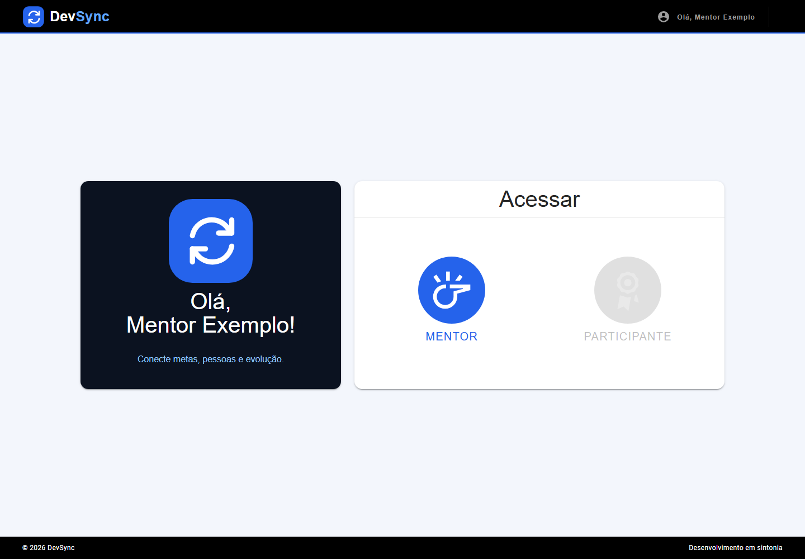
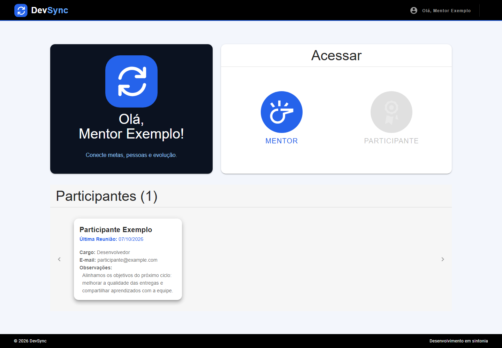
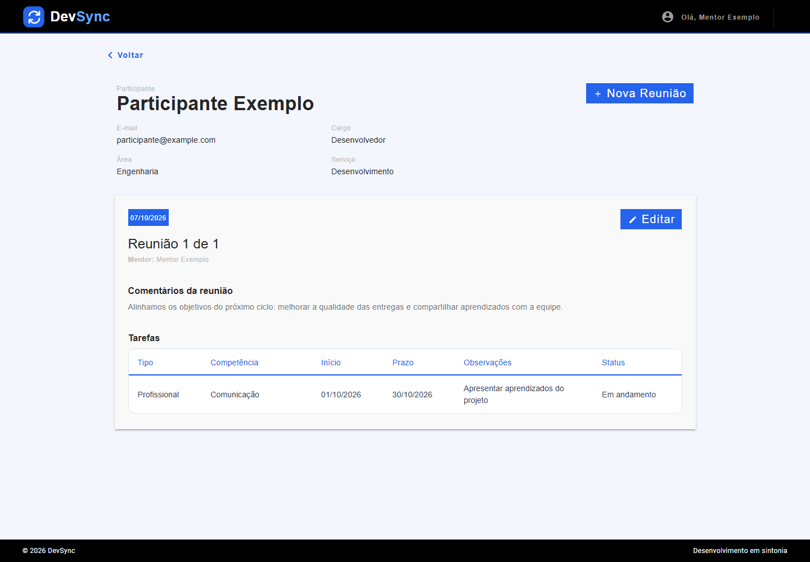
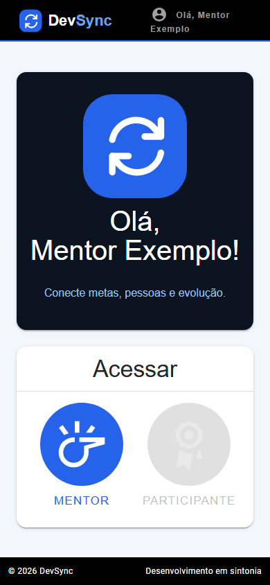
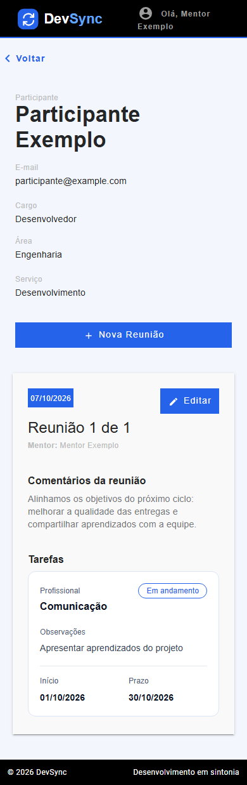
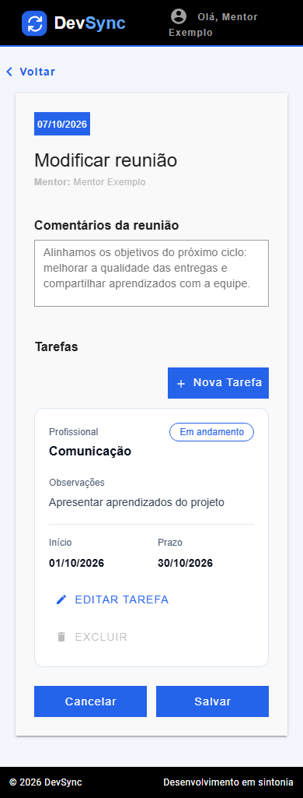

# DevSync

Plataforma para acompanhar desenvolvimento profissional, conectar mentores e participantes e registrar reuniões, competências e atividades.

A identidade visual usa preto e azul, com um símbolo de sincronização formado por duas setas. As rotas e configurações da aplicação usam o nome DevSync e executam localmente.

## Funcionalidades

- Acesso com usuário e senha; integração Microsoft opcional.
- Visão de mentor com seleção dos participantes vinculados.
- Histórico de reuniões com comentários e atividades.
- Cadastro e atualização de reuniões pelo mentor responsável.
- Acompanhamento de competências, prazos e estados das tarefas.
- Administração de usuários, grupos, vínculos e competências.

## Capturas de tela

As imagens foram capturadas da aplicação local em um navegador real. Os nomes, e-mails e registros apresentados são fictícios.

### Boas-vindas



A página pública apresenta um cartão de boas-vindas centralizado entre o cabeçalho e o rodapé e oferece o botão de entrada. Usuários sem autenticação não acessam as reuniões.

### Login



O formulário permite entrar com uma conta cadastrada. A instalação local funciona sem depender de autenticação corporativa.

### Página inicial



Os cartões ficam centralizados na área útil da página. A saudação identifica o usuário e os acessos Mentor e Participante são habilitados conforme os vínculos cadastrados.

### Participantes



Ao selecionar Mentor, a aplicação mostra os participantes vinculados, com cargo, contato e informações da última reunião. Selecionar um cartão abre o histórico correspondente.

### Reuniões e atividades



A tela reúne o perfil do participante, os comentários e as atividades com competência, datas, prazo e estado. O mentor responsável pode criar ou editar reuniões.

### Visualização em celular







Os cartões se organizam verticalmente em telas menores, preservando o acesso às funções principais. O perfil usa campos empilhados e as tarefas aparecem em cartões com competência, estado, observações e datas; a tabela fica disponível no desktop. A edição também usa cartões no celular.

## Tecnologias e estrutura

Frontend: Vue 2, Vue Router, Vuex e Vuetify 2. Backend: Django 5.2, Django REST Framework e SQLite. A versão do Django usada nesta reestruturação pertence à série [5.2 LTS](https://docs.djangoproject.com/en/5.2/releases/5.2/), compatível com o Python 3.13 utilizado na validação.

```text
frontend/
  src/assets/img/       # Logo e símbolo de sincronização em SVG
  src/views/            # Páginas inicial e de reuniões
  public/               # Favicon, logo locais
  scripts/              # Sincronização do build com o template Django
backend/
  config/               # Configurações e rotas
  core/users/           # Usuários e autenticação local
  core/identity/        # Integração Microsoft opcional
  main/record/          # Reuniões, competências, atividades e testes
  templates/            # Templates da aplicação, login e administração
docs/
  screenshots/          # Capturas usadas neste README
```

## Executar localmente

Requisitos: Python 3.10 ou superior, Node.js 22 e npm. Os comandos abaixo partem da raiz do repositório e usam PowerShell.

### 1. Preparar o backend

```powershell
python -m venv .venv
.\.venv\Scripts\Activate.ps1
python -m pip install -r backend/requirements.txt
python backend/manage.py migrate
python backend/manage.py createsuperuser
```

As migrações criam `backend/devsync.sqlite3`. Os bancos históricos não são usados pela nova instalação. Não aponte a configuração para um banco antigo: os nomes dos módulos e o modelo de permissões mudaram, e a importação de dados requer uma migração específica.

### 2. Gerar o frontend

```powershell
npm --prefix frontend ci
npm --prefix frontend run build
```

O build gera os arquivos em `backend/static/frontend/` e sincroniza automaticamente o template Django em `backend/templates/frontend/index.html`. Repita esse comando após alterar o frontend.

### 3. Iniciar

```powershell
python backend/manage.py runserver 127.0.0.1:8000
```

| Serviço | Endereço local |
| --- | --- |
| Aplicação | http://127.0.0.1:8000/devsync/ |
| Login | http://127.0.0.1:8000/devsync/login/ |
| Administração | http://127.0.0.1:8000/devsync/admin/ |
| API | http://127.0.0.1:8000/devsync/api/ |

Também é possível usar `localhost` no lugar de `127.0.0.1`. O servidor de desenvolvimento separado do Vue pode ser iniciado com `npm --prefix frontend run serve`, na porta 8080; para usar autenticação e dados reais, utilize a aplicação servida pelo Django na porta 8000.

## Configurar usuários e vínculos

1. Entre na administração com o superusuário criado.
2. Crie os usuários e suas senhas, preenchendo os dados de perfil e o cargo.
3. Crie os grupos `Mentor` e `Participante` e associe os usuários apropriados.
4. Cadastre uma relação Mentor–Participantes e seus participantes.
5. Cadastre as competências que serão usadas nas atividades.
6. Entre na aplicação com o usuário participante para registrar ou consultar reuniões.

Ser mentor ou participante depende dos vínculos cadastrados. Permissões de administrador são explícitas e não dependem do número do cadastro.

## Configuração

`backend/.env.example` documenta as variáveis disponíveis. O Django lê as variáveis do ambiente; o arquivo `.env` não é carregado automaticamente.

```powershell
$env:DJANGO_SECRET_KEY = 'sua-chave-aleatoria'
$env:DJANGO_DEBUG = 'true'
$env:DJANGO_ALLOWED_HOSTS = 'localhost,127.0.0.1'
```

### Integração Microsoft opcional

```powershell
python -m pip install -r backend/requirements-msal.txt
$env:MS_CLIENT_ID = 'id-da-sua-aplicacao'
$env:MS_CLIENT_SECRET = 'seu-segredo'
$env:MS_TENANT_ID = 'id-do-seu-tenant'
```

A integração é ativada quando `MS_CLIENT_ID` está definido. Configure também segredo, tenant e URI de retorno no provedor. O fluxo de retorno utiliza `/devsync/login_msal_redirect/<destino>/`; o usuário precisa estar cadastrado com o mesmo e-mail. O SSO não foi validado contra um tenant externo nesta reestruturação.

## Validação

```powershell
python backend/manage.py check
python backend/manage.py test main.record.tests
npm --prefix frontend run lint -- --no-fix
npm --prefix frontend run build
```

Os testes cobrem autenticação local, criação explícita de administrador, carregamento das páginas e isolamento do acesso às reuniões. O navegador também verifica ausência de exceções JavaScript e transbordamento horizontal nas telas capturadas.

O build pode emitir avisos sobre o tamanho dos bundles e a base Browserslist antiga. O Django mantém dois avisos sobre relações `ForeignKey(unique=True)` herdadas; essas relações não foram convertidas para evitar alterar os acessos usados pelo sistema.

### Atualizar as capturas

Com a aplicação local iniciada e o frontend compilado, entre com uma conta local vinculada a participantes e capture as telas em desktop e celular. Salve as imagens em `docs/screenshots/`, mantendo os nomes referenciados neste README.

Use dados fictícios nas imagens. O perfil do navegador e as sessões temporárias estão excluídos do Git.

## Mudanças desta reestruturação

- Nome, logo, favicon, rotas e painel administrativo atualizados para DevSync.
- Paleta preta e azul aplicada às telas e controles principais.
- Links e configuração de servidores internos substituídos por caminhos locais.
- Botões de guias e documentos corporativos removidos da aplicação.
- Configurações sensíveis passaram a usar variáveis de ambiente.
- Perfil do usuário interpretado como JSON e carregamento com fallback para fontes indisponíveis.
- Navegação sem autenticação tratada e falhas de API deixam de prender a tela no carregamento.
- Login com senha e criação de superusuário habilitados para instalação independente.
- API restringe leitura aos participantes e alterações ao mentor responsável.
- Backups, bancos históricos, certificados e arquivos gerados estão excluídos do versionamento. Os arquivos históricos foram preservados para consulta e não compõem a aplicação ativa.
